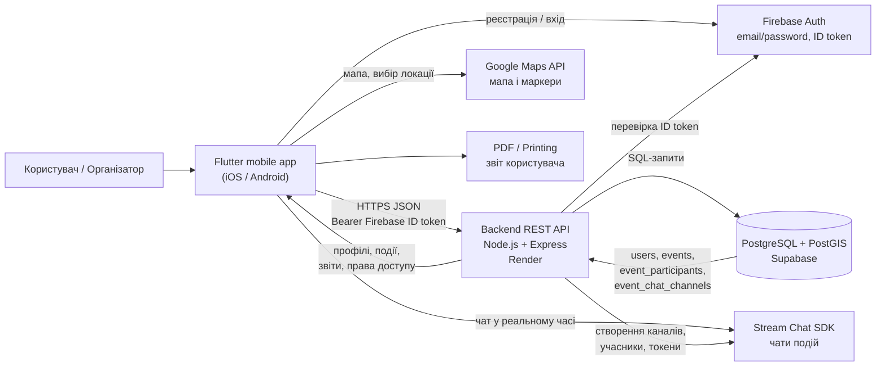
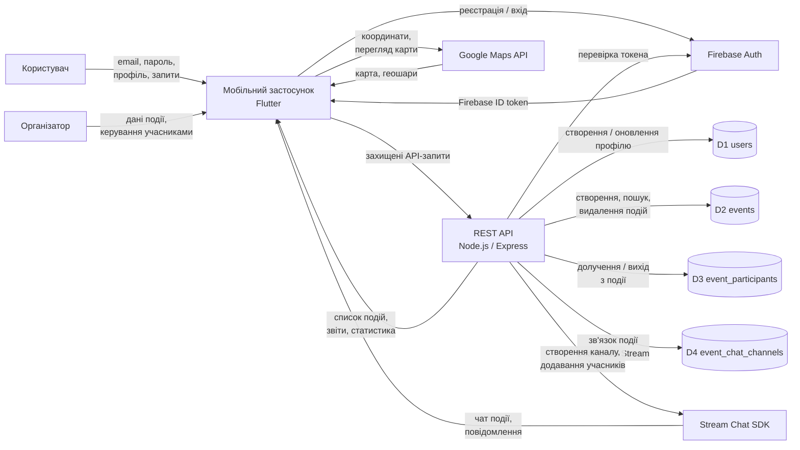
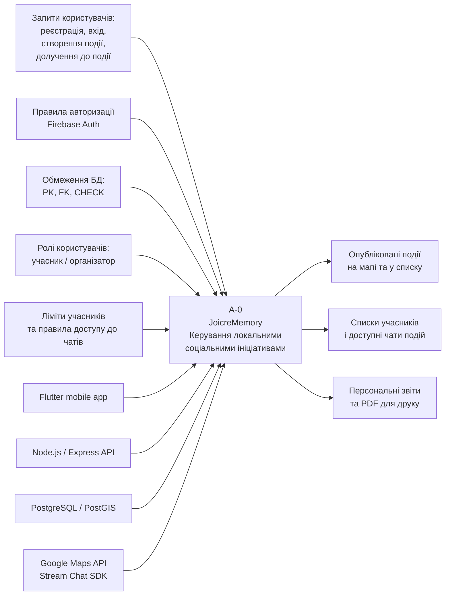
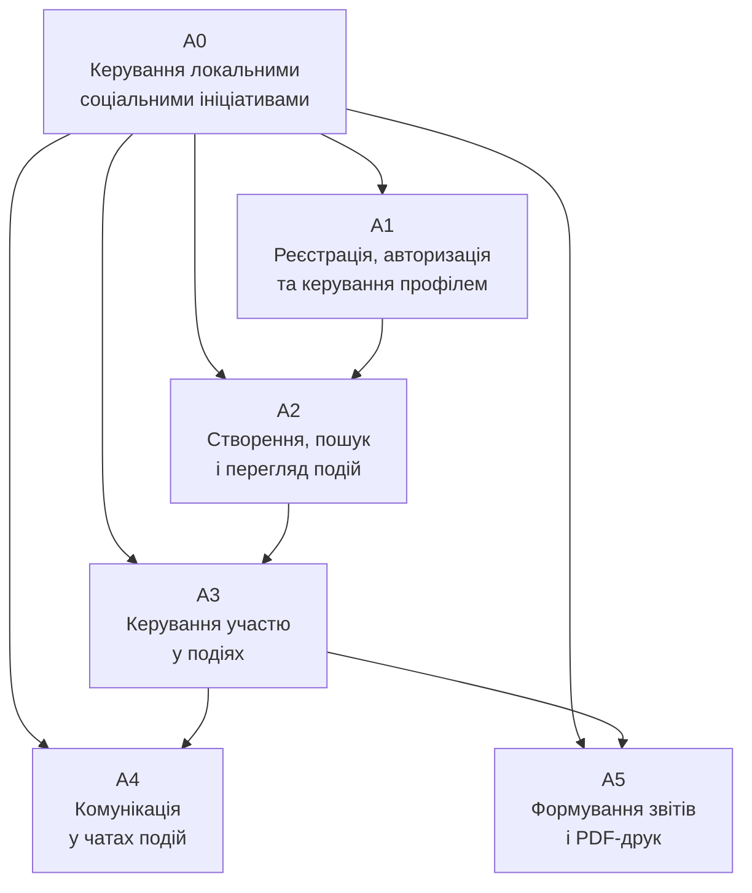
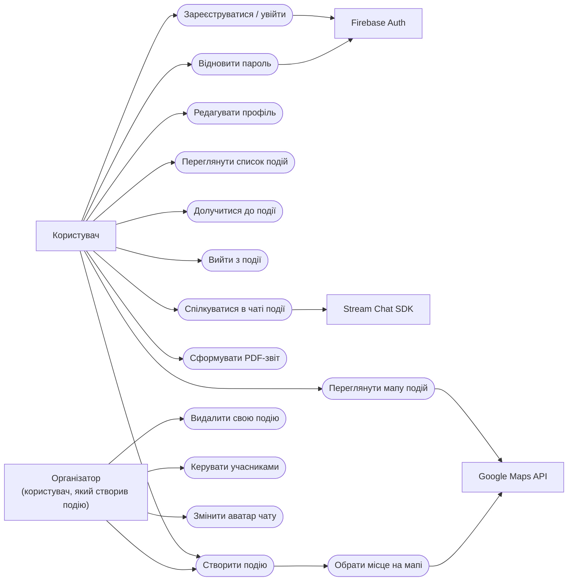
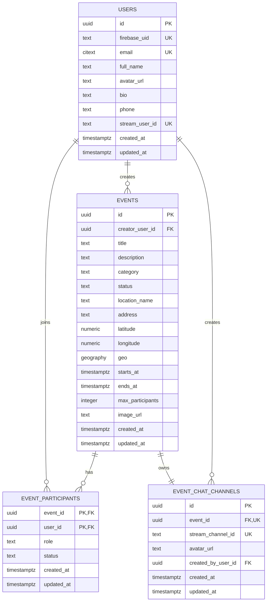
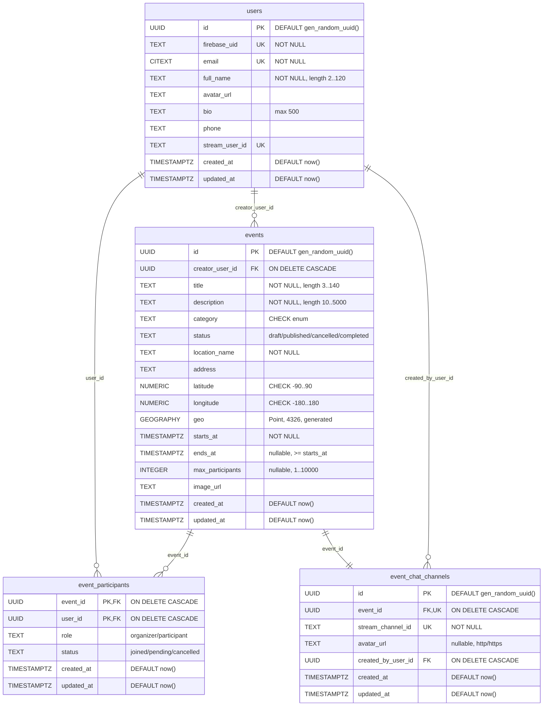

# Mermaid діаграми для курсової JoicreMemory

Цей файл містить Mermaid-код для діаграм, які можна експортувати у PNG/SVG через Mermaid Live Editor або інший інструмент. Діаграми узгоджені з реальною структурою проєкту JoicreMemory: Flutter mobile app, Node.js/Express backend, PostgreSQL/PostGIS у Supabase, Firebase Auth, Stream Chat SDK, Google Maps.

Важливо: у проєкті немає таблиць `messages`, `reviews`, `categories`, `supervisors`, `projects`; повідомлення чатів зберігаються у Stream Chat, а PostgreSQL зберігає лише користувачів, події, участь і зв'язок події з каналом чату.

---

## Рис. 2.1 - Архітектура програмної системи JoicreMemory

---

## Рис. 4.1 - DFD-модель потоків даних

---

## Рис. 4.2 - Контекстна діаграма IDEF0 A-0

Mermaid не є точною нотацією IDEF0, тому після вставки в Draw.io варто вручну трохи розставити стрілки, якщо потрібно. Логіка відповідає IDEF0: вхід зліва, керування зверху, механізми знизу, вихід справа.

Якщо Mermaid у Draw.io розставить блоки неідеально, для звіту достатньо вручну перетягнути блоки так: `C1-C4` зверху, `I1` зліва, `O1-O3` справа, `M1-M4` знизу, `A-0` у центрі.

---

## Рис. 4.2 альтернативний варіант - декомпозиція A0

Цей варіант можна використати як додаткову діаграму, якщо потрібна не контекстна A-0, а декомпозиція процесу.

---

## Рис. 4.3 - UML-діаграма прецедентів

У Mermaid немає повноцінної стандартної UML Use Case-нотації, тому нижче подано лише спрощену візуальну заміну. Для звіту краще використати готовий Draw.io-файл:

`docs/use_case_joicrememory.drawio`

---

## Рис. 5.1 - Логічна модель бази даних

---

## Рис. 5.2 - Фізична модель бази даних PostgreSQL/PostGIS

